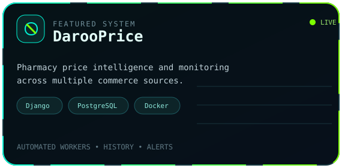
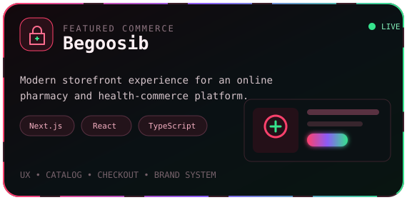

  

  

  
  
  

## `> whoami`

  

I am **MAURON**, a full-stack developer and systems builder focused on useful software: web platforms, data-heavy dashboards, workflow automation, and reliable deployment. I like taking a real operational problem from idea to production — interface, backend, database, infrastructure, and support included.

- Building **DarooPrice**, a pharmacy price-intelligence and monitoring platform.
- Rebuilding **Begoosib**, a modern online-pharmacy commerce experience.
- Developing Telegram and Discord bots, database-backed tools, and automation systems.
- Working across product design, implementation, deployment, and long-term technical support.

## `> featured_systems`

  
  

  
<strong>More about these systems</strong>

   

  **DarooPrice** — A Django and PostgreSQL dashboard that monitors pharmacy-product prices across multiple sources. It includes low-rate 24/7 workers, product approval flows, searchable data, price history, update tracking, and Telegram alerts.

  **Begoosib** — A modern storefront and product experience for an online pharmacy. The new frontend uses React, Next.js, TypeScript, and a Cloudflare-ready deployment stack, with a strong focus on mobile UX, conversion, and brand consistency.

## `> capabilities --verbose`

| Web Systems | Data & Databases |
|:--|:--|
| Full-stack applications, dashboards, commerce experiences, responsive UI, API integration | PostgreSQL, MySQL, SQL Server, data modeling, migrations, reporting, operational support |
| **Automation & Bots** | **Infrastructure & Support** |
| Telegram bots, Discord bots, scraping pipelines, scheduled jobs, notifications | Linux, Docker, Nginx, Cloudflare, production deployment, monitoring, maintenance |

  

  
  
  
  

## `> github_activity --live`

  
  

  

  <picture>
    <source media="(prefers-color-scheme: dark)" srcset="https://raw.githubusercontent.com/mehdimauron/mehdimauron/output/github-contribution-grid-snake-dark.svg" />
    <source media="(prefers-color-scheme: light)" srcset="https://raw.githubusercontent.com/mehdimauron/mehdimauron/output/github-contribution-grid-snake.svg" />
    
  </picture>

## `> connect --channel`

  
  
  
  

  Open to ambitious web systems, automation projects, and technical collaborations.

 

  

