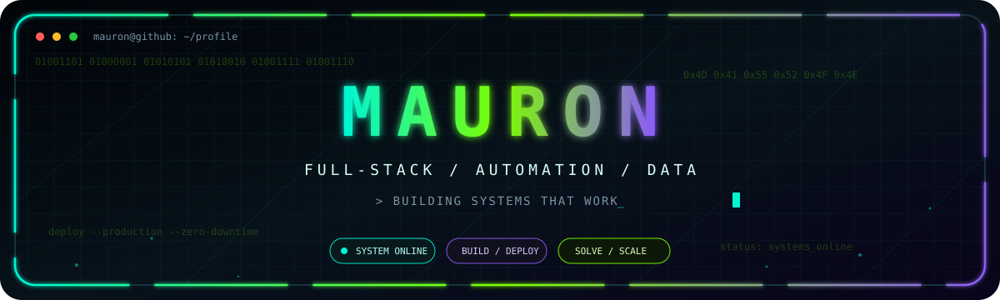

  

## `> whoami`

  

  
<strong>More about these systems</strong>

   

  **DarooPrice** — A Django and PostgreSQL dashboard that monitors pharmacy-product prices across multiple sources. It includes low-rate 24/7 workers, product approval flows, searchable data, price history, update tracking, and Telegram alerts.

  **Begoosib** — A modern storefront and product experience for an online pharmacy. The new frontend uses React, Next.js, TypeScript, and a Cloudflare-ready deployment stack, with a strong focus on mobile UX, conversion, and brand consistency.

## `> capabilities --verbose`

| Web Systems | Data & Databases |
|:--|:--|
| Full-stack applications, dashboards, commerce experiences, responsive UI, API integration | PostgreSQL, MySQL, SQL Server, data modeling, migrations, reporting, operational support |
| **Automation & Bots** | **Infrastructure & Support** |
| Telegram bots, Discord bots, scraping pipelines, scheduled jobs, notifications | Linux, Docker, Nginx, Cloudflare, production deployment, monitoring, maintenance |

  

  
  
  
  

## `> connect --channel`

  
  
  
  

  Open to ambitious web systems, automation projects, and technical collaborations.

 

  

